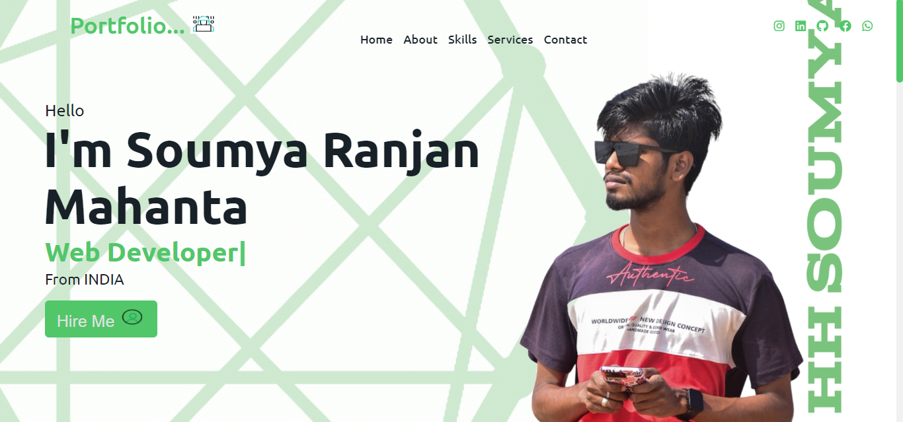

<h1>
<a style="color:#03cc03; font-weight:600;" href="https://me-soumya3969.netlify.app/">Live Link</a>
</h1>  

    <h2><a style="color:red;" href="https://github.com/soumya3969/TAIRP/tree/main/Level_1/Portfolio" alt="task1">TASK - 1 :-</a></h2> <h3 style="color:cyan;">Personal Website</h3><h4>Create a simple personal website that serves as an online presence. You can include an introduction, your skills, education, and contact information. This project will help you practice the fundamentals of HTML and CSS.</h4>
    <a style="color:lime; font-size:15px; font-weight:700;" href="https://portfolio-git-main-soumya3969.vercel.app/" alt="task1">Live Demo 🚀</a>  
    
 
