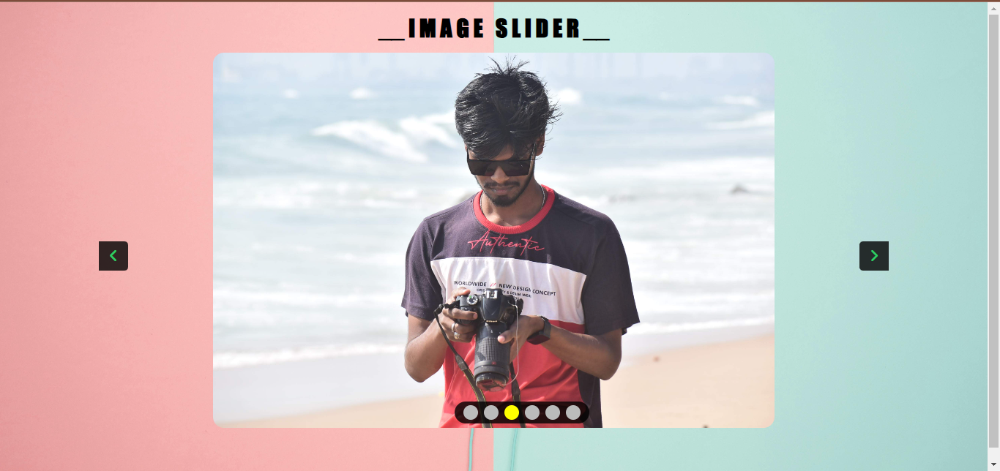

            <h2><a style="color:red;" href="https://github.com/soumya3969/TAIRP/tree/main/Level_1/Slider" alt="task1">TASK - 3 :-</a></h2> <h3 style="color:cyan;">Image Slider</h3><h4>Create an image slider or carousel that displays a series of images in a slideshow format. Use HTML ,CSS and JavaScript/jQuery to create the sliding effect and navigation controls.</h4>
            <a style="color:lime; font-size:15px; font-weight:700;" href="https://image-slider-soumya3969.netlify.app/" alt="task1">Live Demo 🚀</a>
            
        
