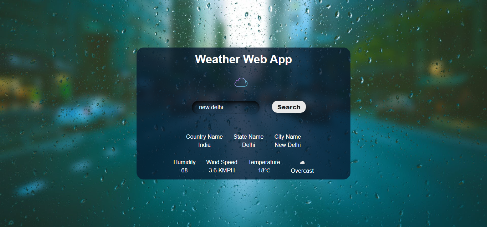

            <h2><a style="color:red;" href="https://github.com/soumya3969/TAIRP/tree/main/Level_2/Weather%20App" alt="task1">TASK - 2 :-</a></h2> <h3 style="color:cyan;">Weather Application</h3><h4>Create a weather application that retrieves and displays weather information for a specific location using a weather API. Users can enter a city name, and the app will fetch and display the current weather conditions. Use HTML for the user interface, CSS for styling, and JavaScript to fetch data from the API and dynamically update the weather information.</h4>
            <a style="color:lime; font-size:15px; font-weight:700;" href="https://weather-soumya3969.netlify.app/" alt="task1">Live Demo 🚀</a>
        
