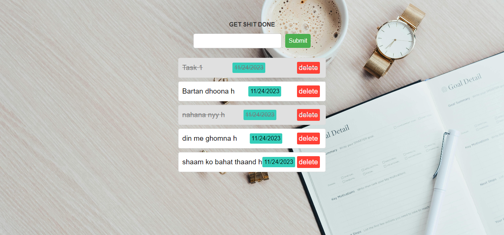

# TECH-A-INTERN

1 Months Internship on Web Development And Designing

    

    

<h1> LEVEL - 1</h1>

        

            <h2><a style="color:red;" href="https://github.com/soumya3969/TAIRP/tree/main/Level_1/Portfolio" alt="task1">TASK - 1 :-</a></h2> <h3 style="color:cyan;">Personal Website</h3><h4>Create a simple personal website that serves as an online presence. You can include an introduction, your skills, education, and contact information. This project will help you practice the fundamentals of HTML and CSS.</h4>
            <a style="color:lime; font-size:15px; font-weight:700;" href="https://portfolio-git-main-soumya3969.vercel.app/" alt="task1">Live Demo 🚀</a>  
            
        

        

            <h2><a style="color:red;" href="https://github.com/soumya3969/TAIRP/tree/main/Level_1/Slider" alt="task1">TASK - 3 :-</a></h2> <h3 style="color:cyan;">Image Slider</h3><h4>Create an image slider or carousel that displays a series of images in a slideshow format. Use HTML ,CSS and JavaScript/jQuery to create the sliding effect and navigation controls.</h4>
            <a style="color:lime; font-size:15px; font-weight:700;" href="https://image-slider-soumya3969.netlify.app/" alt="task1">Live Demo 🚀</a>
            
        

    
   

    

<h1> LEVEL - 2</h1>

        

            <h2><a style="color:red;" href="https://github.com/soumya3969/TAIRP/tree/main/Level_2/Todo%20App" alt="task1">TASK - 1 :-</a></h2> <h3 style="color:cyan;">To-Do List With Local Storage</h3><h4>Build a to-do list application that allows users to create, edit, and delete tasks. Implement the functionality to store the tasks locally using the browser's local storage API. Use HTML to structure the todo list, CSS to style the interface, and JavaScript to handle task management and local storage operations.</h4>
            <a style="color:lime; font-size:15px; font-weight:700;" href="https://todo-soumya3969.netlify.app/" alt="task1">Live Demo 🚀</a>
            
        

        

            <h2><a style="color:red;" href="https://github.com/soumya3969/TAIRP/tree/main/Level_2/Weather%20App" alt="task1">TASK - 2 :-</a></h2> <h3 style="color:cyan;">Weather Application</h3><h4>Create a weather application that retrieves and displays weather information for a specific location using a weather API. Users can enter a city name, and the app will fetch and display the current weather conditions. Use HTML for the user interface, CSS for styling, and JavaScript to fetch data from the API and dynamically update the weather information.</h4>
            <a style="color:lime; font-size:15px; font-weight:700;" href="https://weather-soumya3969.netlify.app/" alt="task1">Live Demo 🚀</a>
        

    

